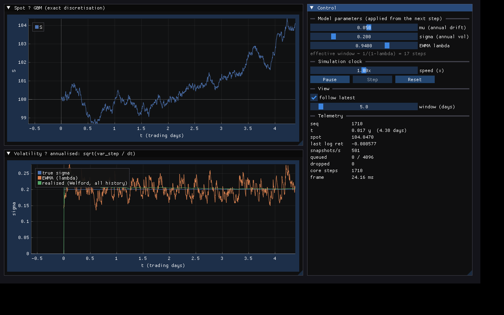

# quantviz — C++ 金融工学ラボ（コア ⇄ リアルタイム描画）

金融工学の理論を **C++20 のコア**で実装し、その状態を **ImGui / ImPlot（M2 以降 OpenGL 3D）でリアルタイム描画**する個人研究プロジェクト。
コアと描画は「Snapshot（コア→描画）」「Command（描画→コア）」の 2 本のロックフリー・リングだけで結ばれる（**双対構造**）。

```
   描画スレッド                             計算スレッド
 ┌──────────────┐   Snapshot ring (SPSC)   ┌──────────────┐
 │ ImPlot 2D    │ ◀──────────────────────  │ Model::step  │
 │ OpenGL 3D    │                          │ Model::snap  │
 │ Control      │ ──────────────────────▶  │ Model::apply │
 └──────────────┘   Command ring  (SPSC)   └──────────────┘
```

## ドキュメント

| 文書 | 内容 |
|---|---|
| [docs/01_design.md](docs/01_design.md) | 設計書 — 原則・アーキテクチャ・型契約・時間モデル・モジュール設計・拡張手順 |
| [docs/02_implementation_plan.md](docs/02_implementation_plan.md) | 実装計画書 — M0〜M5 のスコープ・タスク・完了条件・リスク |
| [docs/03_tdd_spec.md](docs/03_tdd_spec.md) | TDD 仕様網羅 — 全モジュールの仕様を ID 付きテストケースとして列挙（M0 は実装済） |

## M1（この時点）で動くもの



メニューバーの **Scene** で 4 シーンを切り替える（同時に走るシーンは 1 つ。各シーンは独立した Runner + Panel の対）。

| シーン | コア | 描画 |
|---|---|---|
| Streaming（M0） | `Gbm`（厳密離散化）+ `Welford` + `EwmaVariance` | Spot / Volatility / Control |
| Greeks | `black_scholes.hpp`（価格・Δ Γ ν Θ ρ、SIMD ストライク配列版はスカラ版と bit 一致） | Greeks vs K（2 軸）/ Γ(S,T) ヒートマップ / Control（r, σ, T, ストライク幅, スポットショック） |
| GARCH | `garch.hpp`（フィルタ・尤度・MLE）+ `optim.hpp`（Nelder–Mead / BFGS） | σ_t 真値 vs 推定 / 尤度面 L(α,β) + 最適化軌跡 / Control（ω α β, optimizer, 窓） |
| Kalman pair | `mat.hpp` + `kalman.hpp`（Joseph 形、縮退観測は数えてスキップ） | 2 価格 / ヘッジ比率 β̂ ± 2σ 帯 / スプレッド / Control |

- `core/`   : `Gbm`, `Welford`, `EwmaVariance`, `Rng`, `black_scholes`, `optim`, `garch`, `Mat`, `Kalman`
- `bridge/` : `SpscRing`, `Command`, `Model` concept, `SimClock`, `Runner`
- `scenes/` : `StreamingModel`, `GreeksModel`, `GarchModel`, `KalmanPairModel`（すべて POD Snapshot）
- `viz/`    : `SceneRegistry` / `RunnerScene`（vizcore）, 共通の時計 UI（`clock_controls` + `clock_panel`）, 4 パネル
- `tests/`  : Catch2 v3, 107 テストケース（単体・数値・性質・統計・並行・契約・決定性）+ ベンチマーク 3 本

## ビルド

### A. vcpkg（推奨・全プラットフォーム）
```bash
export VCPKG_ROOT=/path/to/vcpkg
cmake --preset dev          # 依存は vcpkg.json から自動解決
cmake --build --preset dev
ctest --preset dev
./build/dev/viz/quantviz_viz
```

### B. vcpkg 無し（Linux）
GLFW をシステムから、ImGui / ImPlot を FetchContent で取得する。
```bash
sudo apt install libglfw3-dev libgl-dev ninja-build
cmake -S . -B build -G Ninja -DCMAKE_BUILD_TYPE=Release
cmake --build build -j
./build/tests/quantviz_tests
./build/viz/quantviz_viz
```

### C. コア + テストのみ（GUI 依存ゼロ、CI 用）
```bash
cmake --preset core-only && cmake --build --preset core-only && ctest --preset core-only
```

ベンチマーク: `./build/.../tests/quantviz_tests "[!benchmark]"`

## ディレクトリ

```
core/    include/quantviz/core/{rng, models/gbm, stats/{welford,ewma,optim,garch,kalman}, math/mat, pricing/black_scholes}.hpp   外部依存ゼロ
bridge/  include/quantviz/bridge/{spsc_ring,command,model_concept,sim_clock,runner}.hpp                                        std のみ
scenes/  include/quantviz/scenes/{streaming,greeks,garch,kalman_pair}_model.hpp                                                 core + bridge
viz/     include/quantviz/viz/{history,clock_controls,scene_registry}.hpp  src/{main.cpp, panels/{clock_panel.hpp, *_panel.*}}   ImGui/ImPlot/GLFW
tests/   Catch2 v3（test_*.cpp = 仕様 ID と 1:1）
docs/    設計書・実装計画書・TDD 仕様（docs/superpowers/plans/ にマイルストーンごとの実行計画）
```

## 依存規則（違反はレビューで差し戻し）

`core` → なし　|　`bridge` → std　|　`scenes` → core, bridge　|　`vizcore` → scenes（GUI なし）　|　`viz` → 全部 + ImGui/ImPlot/GLFW

描画層が `Model` を直接参照すること、コア層が描画ライブラリを include することは禁止。
